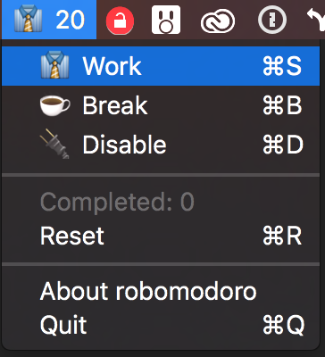

# Robomodoro

Don't sit at your desk all day.

This is a simple implementation of the [Pomodoro Technique](http://pomodorotechnique.com/)

It runs in the menu bar, it doesn't take a bunch of resources, and it might help you not sit at your desk all day.

## Screenshots

Default state:

Work state:

Menu:

Notification

I like to make my notifications `alerts` instead of `banners` so that they stay around until I acknowledge them.

## Attributions

Icons made by [Madebyoliver](http://www.flaticon.com/authors/madebyoliver) from [Flaticon](http://www.flaticon.com) is licensed by [CC 3.0 BY](http://creativecommons.org/licenses/by/3.0/)
